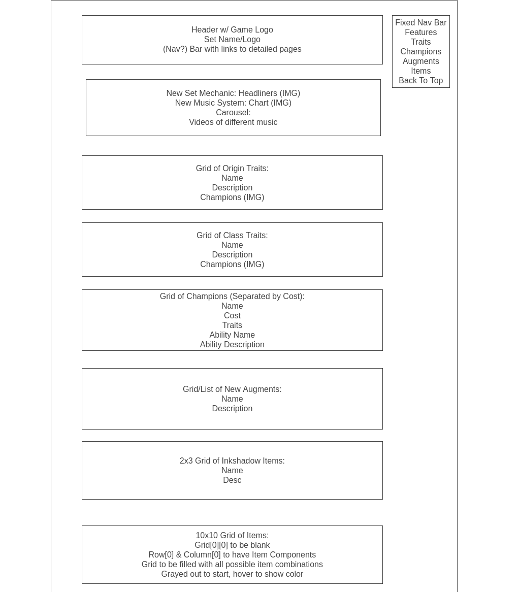

# Tactician's Nexus

[Teamfight Tactics](https://teamfighttactics.leagueoflegends.com/en-us/) (TFT) ) is an auto-battler free-for-all game renowned for its depth of strategy. As a tactician, your role is pivotal in assembling a formidable team amidst the unpredictability of chance. Utilizing your gold, you strategically acquire champions, craft items, and tactically position your formidable roster on the board to engage other tacticians in fierce battles.

What distinguishes TFT, beyond its vibrant artwork and engaging gameplay, is its dynamic rotation of "Sets." Every four months, a new "Set" is introduced, showcasing fresh champions, traits, and mechanics. This perpetual evolution ensures the game remains dynamic and captivating. With each new set, players must adapt their strategies to the evolving meta, fostering a continuous cycle of innovation and challenge.

Yet, as each new set emerges, it also bids farewell to the past, potentially overwhelming players as they navigate the ever-changing landscape. Tactician's Nexus seeks to address this challenge by consolidating all pertinent information regarding the upcoming Set into an all-in-one infographic. This resource aims to streamline the learning process, empowering users to swiftly grasp the nuances of the new set and embark on their TFT journey with confidence.

## Wireframe: 

